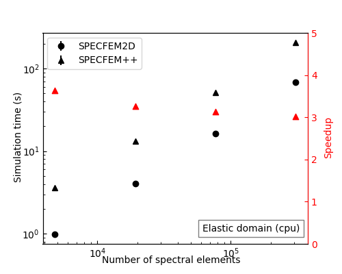

# SPECFEM++ benchmarks

This repository contains workflows to generate performance benchmarks for [SPECFEM++](https://github.com/PrincetonUniversity/SPECFEMPP) against the original SPECFEM solvers ([SPECFEM2D](https://github.com/SPECFEM/specfem2d)). 

The benchmarks are generated using [Snakemake](https://snakemake.readthedocs.io/en/stable/). 

## Benchmarks

Benchmarks for 2D forward simulations : 



## Reproducing the benchmarks

To reproduce the benchmarks, you need to have the following dependencies installed:

1. [SPECFEM2D](https://specfem2d.readthedocs.io/en/latest/authors/) with a working cpu and gpu installation.
2. [SPECFEM++](https://specfem2d-kokkos.readthedocs.io/en/latest/) with a working cpu and gpu installation.
3. [Poetry](https://python-poetry.org/docs/) for managing python dependencies.

Once you have installed the dependencies, you can run the benchmarks using the following steps:

1. Clone the repository:

```bash

git clone 

```

2. Change to the repository directory:

```bash

cd specfempp_benchmarks

```

3. Install the python dependencies:

```bash

poetry install

```

4. Update the `config.yaml`(located within `forward_simulations` directory) file with the paths to the SPECFEM2D and SPECFEM++ executables.

5. Run the benchmarks:

> **Note**: Make sure you have access to a GPU to run GPU benchmarks.

```bash

cd forward_simulations
snakemake -j 4

```

If you are using a SLURM cluster, you can schedule the benchmark runs as slurm jobs using the following command:

```bash

cd forward_simulations
snakemake -j 4 --executor slurm

```

> **Warning**: The benchmarks can take a long time to run depending on the number of processors. 

## License

[](LICENSE)

SPECFEM++ benchmarks is distributed under the [GPL v3 license](LICENSE)

