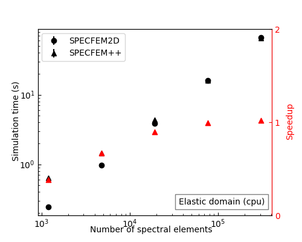

# Forward simulation benchmarks

Below curves show the performance of the SPECFEM++ compared to SPECFEM2D when runnning forward simulations. 

## Elastic Simulation

    
    

## Acoustic Simulation

    
    

## Elastic-Acoustic Coupled Simulation

    
    

